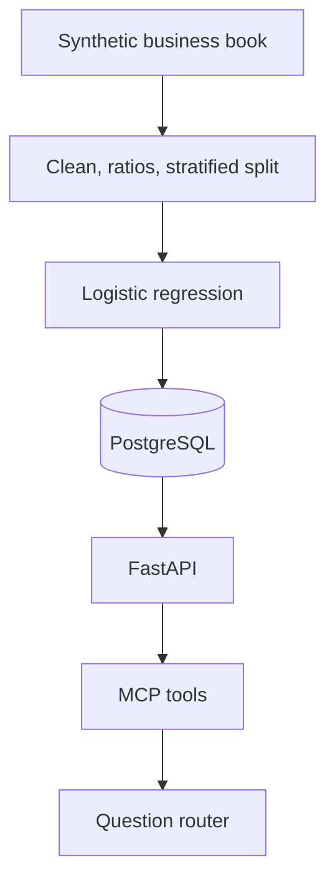

# Business PD Classification

Probability-of-default scoring for a synthetic business-loan book. A logistic regression estimates the probability that a business defaults, stores that score next to the customer and the loan application, and exposes the result through an API, SQL reports, MCP tools, and a small question router.

`default = 0` means Good and `default = 1` means Bad. That label is a simplified teaching target. A live book would use the institution's default policy and the applicable regulatory definition.

## Architecture



| Layer | Role |
| --- | --- |
| `data/` | 10,000 synthetic businesses, then clean, feature, train, and test files |
| `src/` | Generation, validation, ratios, split, training, scoring, database load, SQL reports |
| `model/pd_model.joblib` | Version `pd_model_v1`: standardizer plus logistic regression |
| PostgreSQL | `business_customer`, `loan_application`, `model_prediction` |
| FastAPI | Score, look up, retrain, portfolio, and model information |
| `mcp/server.py` | Six tools that call the API and do not accept SQL |
| `agent/` | Turns a plain-language question into one of those API calls |

Docker Compose runs PostgreSQL and the API. The MCP server and the agent run on the host and call `http://127.0.0.1:8001`.

## Run the service

From this folder:

```powershell
python -m pip install -r requirements.txt
docker compose up -d --build
python -m src.load
```

| Service | Address |
| --- | --- |
| Client walkthrough | http://127.0.0.1:8001 |
| Swagger | http://127.0.0.1:8001/docs |
| PostgreSQL | `127.0.0.1:5434`, database `business_pd` |

Open the client walkthrough, enter an application, and choose **Run assessment**. The page shows each stage in order: the inputs, the data checks, the four banking ratios, the model drivers, the probability and risk class, the database save, and a written assessment. The same page charts the holdout: ranking metrics, predicted probability against the observed default rate by score decile, and the confusion matrix at a 0.50 cutoff.

The same project is published at https://github.com/Vekri/BusinessPD. Vercel runs the FastAPI app from `api.main:app`. The hosted page still scores an application. A PostgreSQL connection is what writes the customer, the loan, and the prediction; without `DATABASE_URL` the score stays on the page.

Host ports are 8001 and 5434 because 8000 and 5432 are already used by other local services. Inside Compose, the API reaches Postgres at `postgres:5432`.

`python -m src.load` rebuilds the three tables from `sql/schema.sql` and loads one customer, one submitted application, and one `pd_model_v1` score for every row in `data/business_credit_features.csv`. Running it again replaces the book. It does not append a second copy.

Ask the agent, with the API already up:

```powershell
python -m agent "Calculate the default probability for business B1001."
python -m agent "Show me all businesses with PD above 15%."
```

Cursor can launch the MCP server as `business-pd` (`python mcp/server.py`). `PD_API_URL` defaults to `http://127.0.0.1:8001`.

## Model

Training uses only `data/train.csv` (8,000 rows, 80%). `data/test.csv` (2,000 rows, 20%) is the holdout. The split is stratified on `default` with seed 42, so both files stay near the book's 23.7% default rate.

Features are the ten raw inputs plus four ratios:

| Ratio | Formula |
| --- | --- |
| `debt_to_asset` | total debt / total assets |
| `loan_to_revenue` | loan amount / annual revenue |
| `profit_margin` | profit / annual revenue |
| `cash_flow_coverage` | cash flow / total debt |

Revenue, assets, and debt must be positive. A zero denominator stops feature generation. The saved pipeline standardizes those columns with a scaler fit on the training rows, then fits `LogisticRegression(max_iter=1000, class_weight="balanced")`. Coefficients are log-odds for a one-standard-deviation move.

Holdout metrics in `model/evaluation.json`, at a 0.50 class cutoff for the classification numbers:

| Metric | Holdout |
| --- | --- |
| Accuracy | 0.813 |
| Precision | 0.579 |
| Recall | 0.777 |
| F1 | 0.664 |
| ROC-AUC | 0.884 |
| Gini | 0.767 |
| KS | 0.615 |

The model ranks risk: observed default rates rise from the lowest score bin to the highest. Predicted probabilities sit above those observed rates because `class_weight="balanced"` trains as if Good and Bad were equally common. PD here is a ranking score from that training setup, not a calibrated frequency of default.

Risk bands are project settings, not a regulatory scale:

| PD | Risk class |
| --- | --- |
| Below 5% | Low Risk |
| 5% up to 10% | Moderate Risk |
| 10% through 20% | High Risk |
| Above 20% | Very High Risk |

## API

| Method | Path | Action |
| --- | --- | --- |
| GET | `/health` | Model version and database status |
| POST | `/predict` | Score one application and store the customer, application, and prediction |
| GET | `/prediction/{business_id}` | Latest stored PD |
| GET | `/business/{business_id}` | Stored customer |
| GET | `/businesses` | Search by name or industry |
| GET | `/portfolio` | Latest scores above `min_pd` (default 0.15), list capped |
| GET | `/model` | Version, features, risk bands, holdout metrics |
| POST | `/train` | Refit on `data/train.csv` and reload the process model |

`POST /predict` accepts the fields in `data/sample_application.json`. `business_name` and `industry` are optional. `POST /train` inside the container writes the new artifact in the container filesystem.

## MCP tools

Each tool calls one API route. None of them accepts SQL.

| Tool | Route |
| --- | --- |
| `get_business` | `GET /business/{id}` |
| `calculate_pd` | `POST /predict` |
| `get_latest_prediction` | `GET /prediction/{id}` |
| `get_portfolio_risk` | `GET /portfolio` |
| `search_businesses` | `GET /businesses` |
| `get_model_information` | `GET /model` |

The question router uses those same routes. A question that names a business and asks for its PD reads the stored score. A question that asks for businesses above a cutoff reads the portfolio. No hosted language-model key is configured, so the router chooses the tool.

## Rebuild the book

Run these from this folder, in order, when the synthetic file should be created again. The generator seed is 42.

```powershell
python -m src.data_generator
python -m src.preprocessing
python -m src.features
python -m src.split
python -m src.train
python -m src.evaluate
python -m src.load
```

Cleaning drops a row when an identifier is blank, a business id is repeated, a number is missing, or a value is outside the bounds in `src/config.py`. Scores are not clipped. Rejected rows, if any, go to `data/rejected_rows.csv`.

`python -m src.report` prints the latest score per business, counts by risk class, and the book above 15% PD. The SQL is in `sql/queries.sql`.

Score one row without the API:

```powershell
python -m src.predict --business-id B00002
python -m src.predict --input data/sample_application.json
```

## Tests

```powershell
pytest
```

`tests/test_e2e.py` builds a small book from raw rows through a holdout score, then calls the running API and the agent. If nothing is listening on port 8001, that second test is skipped.

## Layout

```text
business-pd-classification/
├── api/                  FastAPI app
├── agent/                question router
├── mcp/server.py         MCP tools
├── src/                  data, model, database, reports
├── sql/                  schema and reporting queries
├── data/                 synthetic book and splits
├── model/                joblib artifact and holdout evaluation
├── tests/
├── docker-compose.yml
├── Dockerfile
└── requirements.txt
```
